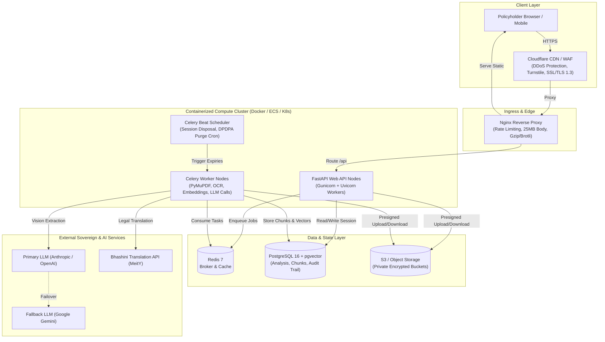

# Pratikar (प्रतिकार) — Production Engineering & Deployment Guide

> **Target:** Enterprise Production-Ready Deployment  
> **Applicable Regulations:** IRDAI Master Circular 2024, Digital Personal Data Protection Act (DPDPA) 2023, MeitY Sovereign Cloud Guidelines  
> **Tech Stack:** FastAPI (Python 3.12+), React 18 (Vite, TypeScript), PostgreSQL 16 + pgvector, Celery + Redis, ReportLab, Bhashini API, Docker, Nginx, AWS/Supabase

---

## 1. System Audit & Production Gap Analysis

| Capability / Layer | Current State (Prototype) | Production-Ready Target | Priority |
| :--- | :--- | :--- | :--- |
| **Data Persistence** | In-memory `SessionDatabase` dictionary in `database.py`. Data is wiped on server restart. | PostgreSQL 16 + `pgvector` with connection pooling (`asyncpg` / `SQLAlchemy 2.0` / Supabase). Document metadata and chunk embeddings persisted with transactional integrity. | **P0 (Critical)** |
| **Ingestion Pipeline** | Synchronous PyMuPDF execution inside FastAPI HTTP request handlers. 60-page PDFs can block event loop or trigger HTTP 504 timeouts. | Asynchronous job queue (`Celery` or `ARQ` backed by `Redis`). Client receives immediate `analysis_id` and polls via SSE / WebSocket / polling. | **P0 (Critical)** |
| **Extraction & OCR** | Heuristic regex parser (`heuristic_claim_extractor`) + mock LLM fallback. | Multi-modal Vision Pipeline: Image deskewing (Pillow) + Tesseract/AWS Textract OCR fallback + Multi-modal LLM (Claude 3.5 Sonnet / GPT-4o / Gemini 1.5 Pro) with strict JSON Schema output and zero-hallucination validation. | **P0 (Critical)** |
| **Document Storage** | In-memory raw bytes (`uploaded_files`, `generated_docs`). High RAM usage on concurrent uploads. | S3-compatible Object Storage (AWS S3 / Supabase Storage / Cloudflare R2) with short-lived presigned URLs (15-min TTL) and client-side encryption. | **P0 (Critical)** |
| **Translation Service** | Hardcoded regex dictionary with Bhashini skeleton. | Live Government of India Bhashini ULCA API integration with exponential backoff, circuit breaker, and offline legal-domain fallback. | **P1 (High)** |
| **Privacy & Compliance** | Manual session disposal and 60-min TTL in memory. | Automated DPDPA 2023 cascade purge: PostgreSQL `pg_cron` / Celery task executing cryptographic wipe of documents and derived embeddings upon expiry. Automated PII scrubbing (Presidio/regex). | **P0 (Critical)** |
| **Security & Auth** | Wildcard CORS (`*`), no rate limiting, no bot protection. | Strict CORS origin whitelist, Redis-backed rate limiting (Slowapi), Cloudflare Turnstile CAPTCHA, file magic-byte validation, TLS 1.3. | **P0 (Critical)** |
| **Observability** | Standard stdout JSON logger. | OpenTelemetry instrumentation, Sentry APM & error tracking, Prometheus `/metrics` + Grafana dashboard, immutable regulatory audit logs. | **P1 (High)** |

---

## 2. Infrastructure Architecture & Production Topologies



---

## 3. Database Migration & Persistent Storage Setup

### 3.1 Supabase / Self-Hosted PostgreSQL 16 Setup
1. Enable extensions:
   ```sql
   CREATE EXTENSION IF NOT EXISTS "uuid-ossp";
   CREATE EXTENSION IF NOT EXISTS vector;
   CREATE EXTENSION IF NOT EXISTS pg_cron;
   ```
2. Apply the production schema located in `backend/db/schema.sql`.
3. Configure the DPDPA 2023 automated cascade purge routine:
   ```sql
   -- Auto-purge expired sessions every 10 minutes (DPDPA 2023 §8 compliance)
   SELECT cron.schedule('purge-expired-sessions', '*/10 * * * *', $$
     DELETE FROM analysis WHERE expires_at < NOW();
   $$);
   ```
   *Because `ON DELETE CASCADE` is configured across `document`, `claim_record`, `policy_chunk`, `rule_result`, `verdict`, `evidence_item`, and `generated_document`, deleting the parent analysis record instantly and atomically purges all derived legal and personal data.*

### 3.2 SQLAlchemy 2.0 / AsyncPG Database Driver
Replace the in-memory dictionary in `backend/app/db/database.py` with an async connection pool:
```python
from sqlalchemy.ext.asyncio import create_async_engine, AsyncSession, async_sessionmaker
from app.core.config import settings

DATABASE_URL = settings.DATABASE_URL.replace("postgresql://", "postgresql+asyncpg://")

engine = create_async_engine(
    DATABASE_URL,
    pool_size=20,
    max_overflow=10,
    pool_pre_ping=True,
    pool_recycle=1800,
)
AsyncSessionLocal = async_sessionmaker(engine, expire_on_commit=False, class_=AsyncSession)
```

---

## 4. Async Task Pipeline (Decoupling Heavy Ingestion)

Policy documents range from 40 to 80 pages (5MB to 20MB). Processing text extraction, vector embedding, and vision models must never occur within the HTTP request/response cycle.

### 4.1 Celery + Redis Task Queue Setup
Create `backend/app/core/celery_app.py`:
```python
from celery import Celery
from app.core.config import settings

celery_app = Celery(
    "pratikar_tasks",
    broker=settings.REDIS_URL,
    backend=settings.REDIS_URL,
)

celery_app.conf.update(
    task_serializer="json",
    accept_content=["json"],
    result_serializer="json",
    timezone="UTC",
    enable_utc=True,
    task_track_started=True,
    task_time_limit=180,       # Hard timeout: 3 minutes
    task_soft_time_limit=150,  # Soft timeout: 2.5 minutes
)
```

### 4.2 Background Analysis Worker
Create `backend/app/tasks/pipeline.py`:
```python
from app.core.celery_app import celery_app
from app.ingestion.parser import parse_policy_document
from app.extraction.extractor import ClaimExtractor
from app.retrieval.retriever import ClauseRetriever
from app.rules.rule_engine import RuleEngine
from app.merge.grounding_gate import GroundingGate

@celery_app.task(bind=True, max_retries=2)
def run_claim_analysis_pipeline(self, analysis_id: str, letter_s3_key: str, policy_s3_key: str, language: str):
    # 1. Download documents from secure S3 bucket
    # 2. Extract structured claim record via multi-modal extractor
    # 3. Parse policy into page-indexed chunks
    # 4. Execute Path A (Deterministic IRDAI Rulebook)
    # 5. Execute Path B (Verbatim Policy Clause Retrieval)
    # 6. Apply Grounding Gate (enforce source integrity)
    # 7. Persist verdict & mark analysis_id as 'complete'
    pass
```

---

## 5. Vision Extraction & LLM Two-Provider Failover Pipeline

In production, user rejection letters are frequently camera photographs taken in varied lighting.

### 5.1 Defense-in-Depth Extraction Flow
1. **Preprocessing:** PIL auto-rotation via EXIF + auto-contrast enhancement.
2. **Scanned PDF / Photo Fallback:** If PDF text stream contains < 50 characters, route to multi-modal vision models.
3. **Primary Provider:** Anthropic Claude 3.5 Sonnet / OpenAI GPT-4o with structured JSON schema output:
   ```json
   {
     "insurer_name": "Star Health and Allied Insurance",
     "policy_number": "P/111111/01/2022/000001",
     "claim_reference": "CIR/2026/0001",
     "claim_amount": 250000.0,
     "rejection_date": "2026-08-15",
     "stated_ground": "Pre-existing disease hypertension not disclosed",
     "cited_clause_ref": "Clause 4.2",
     "policy_inception_date": "2021-01-10",
     "continuous_months": 67
   }
   ```
4. **Automated Secondary Failover:** If primary provider returns 5xx or times out (>15s), seamlessly dispatch to Google Gemini 1.5 Pro.
5. **Prompt Injection Defense (SEC-10):** Document text is never interpolated into user prompts; it is supplied strictly as isolated JSON/blob payloads with system instructions forbidding role assumption.

---

## 6. Security, Privacy & DPDPA 2023 Compliance

### 6.1 India DPDPA (Digital Personal Data Protection Act) 2023 Protocol
- **Consent Notice:** Explicit user confirmation modal before uploading medical or claim records.
- **PII Redaction Engine:** Integrate Microsoft Presidio or spaCy regex pipeline to redact Aadhaar numbers (`\b\d{4}\s?\d{4}\s?\d{4}\b`), PAN cards (`[A-Z]{5}[0-9]{4}[A-Z]`), and bank account numbers from extracted text before storage.
- **Data Minimization:** No raw health records or diagnostic PDFs are stored permanently. Document binaries in S3 are tagged with an S3 Lifecycle Rule set to 24 hours.

### 6.2 Hardening FastAPI
```python
# Rate limiting via Slowapi
from slowapi import Limiter, _rate_limit_exceeded_handler
from slowapi.util import get_remote_address
from slowapi.errors import RateLimitExceeded

limiter = Limiter(key_func=get_remote_address, default_limits=["60/minute"])
app.state.limiter = limiter
app.add_exception_handler(RateLimitExceeded, _rate_limit_exceeded_handler)

# Secure headers middleware
@app.middleware("http")
async def add_security_headers(request: Request, call_next):
    response = await call_next(request)
    response.headers["X-Content-Type-Options"] = "nosniff"
    response.headers["X-Frame-Options"] = "DENY"
    response.headers["Content-Security-Policy"] = "default-src 'self'; img-src 'self' data:; script-src 'self'"
    response.headers["Strict-Transport-Security"] = "max-age=31536000; includeSubDomains"
    return response
```

---

## 7. Containerization (Production Dockerfiles)

### 7.1 Backend Dockerfile (`backend/Dockerfile`)
```dockerfile
# Multi-stage production build for FastAPI Backend
FROM python:3.12-slim AS builder

WORKDIR /build
RUN apt-get update && apt-get install -y --no-install-recommends \
    build-essential \
    libmupdf-dev \
    && rm -rf /var/lib/apt/lists/*

COPY requirements.txt .
RUN pip install --no-cache-dir --user -r requirements.txt

FROM python:3.12-slim AS runner

WORKDIR /app
RUN apt-get update && apt-get install -y --no-install-recommends \
    curl \
    tesseract-ocr \
    fonts-noto-core \
    && rm -rf /var/lib/apt/lists/*

COPY --from=builder /root/.local /root/.local
ENV PATH=/root/.local/bin:$PATH
ENV PYTHONPATH=/app

# Create unprivileged application user
RUN useradd -m -u 1001 appuser
COPY --chown=appuser:appuser . /app
USER appuser

EXPOSE 8000
HEALTHCHECK --interval=30s --timeout=5s --start-period=5s --retries=3 \
  CMD curl -f http://localhost:8000/api/health || exit 1

CMD ["uvicorn", "app.main:app", "--host", "0.0.0.0", "--port", "8000", "--workers", "4"]
```

### 7.2 Frontend Dockerfile (`frontend/Dockerfile`)
```dockerfile
# Stage 1: Build static assets
FROM node:20-alpine AS build
WORKDIR /app
COPY package*.json ./
RUN npm ci
COPY . .
RUN npm run build

# Stage 2: Serve via Nginx
FROM nginx:alpine
COPY --from=build /app/dist /usr/share/nginx/html
COPY nginx.conf /etc/nginx/conf.d/default.conf
EXPOSE 80
CMD ["nginx", "-g", "daemon off;"]
```

### 7.3 Frontend Nginx Configuration (`frontend/nginx.conf`)
```nginx
server {
    listen 80;
    server_name localhost;

    client_max_body_size 25M;

    # Gzip compression
    gzip on;
    gzip_types text/plain text/css application/json application/javascript text/xml application/xml application/xml+rss text/javascript;

    location / {
        root /usr/share/nginx/html;
        index index.html;
        try_files $uri $uri/ /index.html;
    }

    # Proxy API calls to FastAPI backend container
    location /api/ {
        proxy_pass http://backend:8000/api/;
        proxy_http_version 1.1;
        proxy_set_header Upgrade $http_upgrade;
        proxy_set_header Connection 'upgrade';
        proxy_set_header Host $host;
        proxy_set_header X-Real-IP $remote_addr;
        proxy_set_header X-Forwarded-For $proxy_add_x_forwarded_for;
        proxy_set_header X-Forwarded-Proto $scheme;
        proxy_read_timeout 180s;
        proxy_connect_timeout 60s;
    }
}
```

### 7.4 Production Docker Compose (`docker-compose.prod.yml`)
```yaml
version: '3.8'

services:
  frontend:
    build:
      context: ./frontend
      dockerfile: Dockerfile
    ports:
      - "80:80"
    depends_on:
      - backend
    restart: always

  backend:
    build:
      context: ./backend
      dockerfile: Dockerfile
    environment:
      - DATABASE_URL=postgresql+asyncpg://postgres:${POSTGRES_PASSWORD}@db:5432/pratikar
      - REDIS_URL=redis://redis:6379/0
      - LLM_PRIMARY_KEY=${LLM_PRIMARY_KEY}
      - LLM_FALLBACK_KEY=${LLM_FALLBACK_KEY}
      - BHASHINI_KEY=${BHASHINI_KEY}
    depends_on:
      - db
      - redis
    restart: always

  celery_worker:
    build:
      context: ./backend
      dockerfile: Dockerfile
    command: celery -A app.core.celery_app.celery_app worker --loglevel=info --concurrency=4
    environment:
      - DATABASE_URL=postgresql+asyncpg://postgres:${POSTGRES_PASSWORD}@db:5432/pratikar
      - REDIS_URL=redis://redis:6379/0
      - LLM_PRIMARY_KEY=${LLM_PRIMARY_KEY}
      - LLM_FALLBACK_KEY=${LLM_FALLBACK_KEY}
      - BHASHINI_KEY=${BHASHINI_KEY}
    depends_on:
      - redis
      - db
    restart: always

  redis:
    image: redis:7-alpine
    restart: always
    volumes:
      - redis_data:/data

  db:
    image: pgvector/pgvector:pg16
    environment:
      POSTGRES_DB: pratikar
      POSTGRES_USER: postgres
      POSTGRES_PASSWORD: ${POSTGRES_PASSWORD}
    volumes:
      - pg_data:/var/lib/postgresql/data
      - ./backend/db/schema.sql:/docker-entrypoint-initdb.d/init.sql
    restart: always

volumes:
  redis_data:
  pg_data:
```

---

## 8. CI/CD Pipeline (GitHub Actions)

Create `.github/workflows/deploy.yml`:
```yaml
name: Production CI/CD

on:
  push:
    branches: [ main ]
  pull_request:
    branches: [ main ]

jobs:
  test-backend:
    runs-on: ubuntu-latest
    steps:
      - uses: actions/checkout@v4
      - name: Set up Python
        uses: actions/setup-python@v5
        with:
          python-version: '3.12'
          cache: 'pip'
      - name: Install dependencies
        run: |
          cd backend
          pip install -r requirements.txt
      - name: Run Pytest Suite
        run: |
          PYTHONPATH=backend pytest backend/tests/ -v --cov=app

  test-frontend:
    runs-on: ubuntu-latest
    steps:
      - uses: actions/checkout@v4
      - name: Set up Node.js
        uses: actions/setup-node@v4
        with:
          node-version: '20'
          cache: 'npm'
          cache-dependency-path: frontend/package-lock.json
      - name: Install & Build
        run: |
          cd frontend
          npm ci
          npm run build

  deploy:
    needs: [test-backend, test-frontend]
    if: github.ref == 'refs/heads/main'
    runs-on: ubuntu-latest
    steps:
      - uses: actions/checkout@v4
      - name: Deploy to Cloud Container Host (e.g. AWS / Cloud Run / Render)
        run: |
          echo "Triggering deployment webhook or dispatching container build..."
```

---

## 9. Cloud Deployment Playbook (Step-by-Step)

### Strategy 1: Managed Sovereign Cloud (AWS India Mumbai `ap-south-1`)
1. **Database:** AWS RDS for PostgreSQL 16 (Multi-AZ) with `pgvector` enabled.
2. **Compute:** AWS ECS Fargate running the Backend, Celery Worker, and Redis (ElastiCache).
3. **Storage:** AWS S3 Private Bucket with SSE-KMS customer-managed keys and 24-hour lifecycle deletion.
4. **Edge:** CloudFront CDN caching frontend assets with Cloudflare WAF or AWS WAF blocking suspicious IP ranges and rate-limiting `/api/analyses`.

### Strategy 2: PaaS (Render / Railway + Supabase) — Rapid Deployment (<1 Day)
1. **Supabase:** Provision a free/pro tier project in `ap-south-1` (Mumbai). Run `backend/db/schema.sql` in SQL Editor.
2. **Render/Railway Backend Web Service:**
   - Link repository.
   - Build Command: `pip install -r backend/requirements.txt`
   - Start Command: `uvicorn app.main:app --host 0.0.0.0 --port $PORT`
   - Set environment variables (`DATABASE_URL`, `SUPABASE_URL`, `SUPABASE_SERVICE_KEY`, `LLM_PRIMARY_KEY`).
3. **Render/Railway Worker Service:**
   - Add Redis service.
   - Run Celery worker command.
4. **Vercel / Cloudflare Pages Frontend:**
   - Link `frontend/` folder.
   - Framework preset: Vite.
   - Rewrites: `/api/*` -> `https://pratikar-api.onrender.com/api/*`.

---

## 10. Regulatory Audit Trail & Ombudsman Evidence Standard

To satisfy Insurance Ombudsman scrutiny under Rule 14 of the Insurance Ombudsman Rules, 2017:
1. **Cryptographic Proof of Grounding:** Every generated claim verdict stores an immutable SHA-256 hash of:
   - The verbatim quoted policy wording span.
   - The bounding page number of the policy PDF.
   - The IRDAI Master Circular 2024 clause number.
2. **Audit Extraction Log:** If an appeal is filed, an exportable JSON package containing the exact timeline, extracted fields, grounding gate decisions, and GRO appeal letter is accessible for Ombudsperson review.
