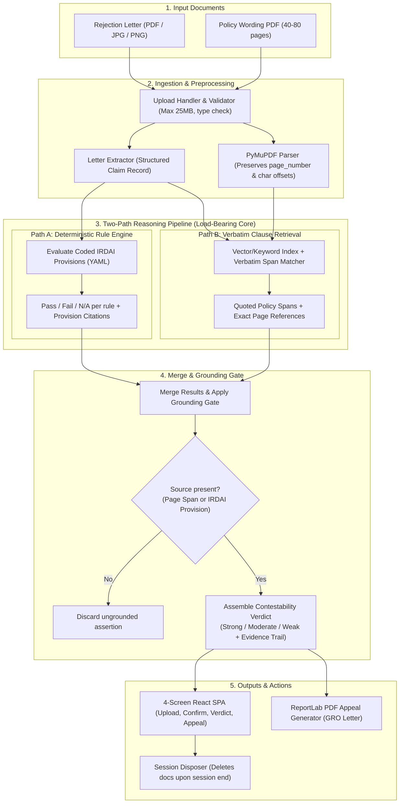

# Pratikar — Build Status Check & Master Implementation Plan

**Date:** 19 September 2026 (Grand Final: 20 September 2026)  
**Theme:** FinTech / InsurTech, Open Innovation track (Geek2Code 2026)  
**Team:** Sid, Pratham, Navya, Parnika, Dhiraj  

---

## 0. Build Status Report (§0.1 Time-Critical Check)

As required by **Operating Instructions §0.1**, Antigravity inspected the workspace (`/Users/adnan/Desktop/Partikar`) in full prior to creating or modifying any code.

### Status Table

| Component / Capability | Status | Notes |
| :--- | :--- | :--- |
| **1. Document upload** | **Not started** | No upload handler, route, or storage layer exists. |
| **2. Policy parsing with page references** | **Not started** | No PyMuPDF parsing or page-mapping logic exists. |
| **3. Letter extraction into claim record** | **Not started** | No vision or long-context extraction exists. |
| **4. Deterministic rule engine** | **Not started** | No YAML rulebook or Python rule evaluator exists. |
| **5. Verbatim clause retrieval** | **Not started** | No policy chunk indexing or quote-or-abstain retrieval exists. |
| **6. Merge / grounding gate** | **Not started** | No merge logic or source-enforcement gate exists. |
| **7. Contestability verdict & evidence trail** | **Not started** | No verdict assembly or citation resolver exists. |
| **8. One generated appeal document (PDF)** | **Not started** | No ReportLab grievance letter generator exists. |
| **9. Session disposal (privacy / TTL)** | **Not started** | No session cleanup or cascade deletion exists. |
| **10. Second-provider failover** | **Not started** | No LLM orchestration or failover chain exists. |

### Operational Reality & Priority Alignment
- **Current state:** The project repository currently contains only specification documents (`Pratikar BRD.pdf`, `Pratikar PRD.docx`, `Pratikar PRD.pdf`, `Pratikar_Geek2Code.pptx`, `Pratikar_Technology_Stack_and_Architecture.pdf`). No application code or scaffolding has been written.
- **Immediate Mandate (Tech Stack §15 / Operating Instructions §0.1 Item 4):**
  > *"If the core pipeline (upload → extraction → rule engine → clause retrieval → merge → verdict) is not yet returning a cited verdict on a real document, treat that as the only priority — do not build frontend polish, Hindi output, or Phase 2 features until it does."*
- **Execution Strategy:** We will build the system in strict accordance with the Technology Stack and PRD specifications, prioritizing Phase 1–4 (the working core cited-verdict pipeline with zero grounding violations) first, followed immediately by the 7-endpoint API, the pre-cached demo cases (<5s), the 4-screen React UI, and test suites.

---

## 1. Architecture & Core Pipeline Design



---

## 2. User Review Required

> [!IMPORTANT]
> **API Keys & Offline Resilience:**
> In hackathon demo environments, external LLM APIs (OpenAI, Anthropic, Gemini) and Supabase might experience rate limits, cold starts, or missing keys. The implementation will include:
> 1. Full support for live API keys (`LLM_PRIMARY_KEY`, `LLM_FALLBACK_KEY`, `SUPABASE_URL`, `SUPABASE_SERVICE_KEY`) via `.env`.
> 2. Complete, deterministic offline execution with pre-cached demo cases (<5s response time per Tech Stack §12.2) and local mock/heuristic extraction fallback if no keys are set.
> 3. This ensures the demo **never crashes** under any circumstance.

> [!WARNING]
> **Open Decision #4 (2020 Non-Payable Items Circular):**
> Per PRD §12 and Tech Stack §15/§17, whether the 146-item non-payable list survived the 2024 Master Circular repeal schedule is an unconfirmed legal question. In accordance with PRD instructions, we will isolate non-payable items in the rulebook, and default to established 2024 Master Circular provisions (`moratorium_60_month`, `cashless_turnaround`, `discharge_turnaround`, `waiting_period_ped`) so that unverified rules never compromise verdict integrity.

---

## 3. Proposed Changes & Implementation Steps

### Directory Structure to Create
Following Tech Stack §7.1:
```
/Users/adnan/Desktop/Partikar/
├── backend/
│   ├── app/
│   │   ├── api/
│   │   │   ├── __init__.py
│   │   │   ├── analyses.py      # All 7 endpoints
│   │   │   └── health.py        # /api/health with provider check
│   │   ├── core/
│   │   │   ├── config.py        # Pydantic Settings from env vars
│   │   │   └── logging.py       # Structured JSON logging to stdout
│   │   ├── db/
│   │   │   ├── __init__.py
│   │   │   ├── database.py      # Session repository & cascade delete
│   │   │   └── schema.sql       # Supabase / Postgres DDL
│   │   ├── extraction/
│   │   │   ├── __init__.py
│   │   │   ├── extractor.py     # Claim record extraction (primary + fallback)
│   │   │   └── schema.py        # StructuredClaimRecord Pydantic model
│   │   ├── generation/
│   │   │   ├── __init__.py
│   │   │   └── appeal_pdf.py    # ReportLab GRO appeal generator (with Noto Sans)
│   │   ├── ingestion/
│   │   │   ├── __init__.py
│   │   │   ├── parser.py        # PyMuPDF page-scoped parsing with offset tracking
│   │   │   └── validator.py     # File type, size (25MB), scanned PDF detection
│   │   ├── merge/
│   │   │   ├── __init__.py
│   │   │   └── grounding_gate.py# Hard gate: drop ungrounded statements
│   │   ├── models/
│   │   │   ├── __init__.py
│   │   │   └── schemas.py       # Verdict, EvidenceItem, AnalysisResponse
│   │   ├── retrieval/
│   │   │   ├── __init__.py
│   │   │   └── retriever.py     # Verbatim clause retrieval + quote-or-abstain
│   │   ├── rules/
│   │   │   ├── __init__.py
│   │   │   └── rule_engine.py   # Deterministic IRDAI rule engine
│   │   ├── translation/
│   │   │   ├── __init__.py
│   │   │   └── translator.py    # Hindi translation with offline dictionary fallback
│   │   └── main.py              # FastAPI app instantiation, CORS, error handling
│   ├── rulebook/
│   │   └── irdai_rules.yaml     # Navya's regulatory rulebook data
│   ├── demo_cases/              # 3 pre-cached demo cases + 1 reserved unseen case
│   │   ├── case_1_strong_moratorium.json
│   │   ├── case_2_weak_valid_rejection.json
│   │   ├── case_3_vague_no_clause.json
│   │   └── demo_assets/         # Sample rejection letters & policy PDFs
│   ├── tests/
│   │   ├── test_rule_engine.py  # Real unit tests for deterministic rules
│   │   ├── test_grounding_gate.py# Verification that violations are 0
│   │   ├── test_pipeline.py     # End-to-end pipeline test on demo cases
│   │   └── test_api.py          # API test for all 7 endpoints
│   ├── requirements.txt         # Pinned Python dependencies
│   └── run.sh                   # One-command backend startup script
├── frontend/
│   ├── src/
│   │   ├── api/
│   │   │   └── client.ts        # Typed API client for the 7 endpoints
│   │   ├── components/
│   │   │   ├── EvidenceTrail.tsx# Clickable citations resolving to policy page & text
│   │   │   ├── VerdictCard.tsx  # Strong / Moderate / Weak banner & reasons
│   │   │   ├── NonAdviceNotice.tsx# Statutory deadline & legal disclaimer
│   │   │   ├── LanguageToggle.tsx # English / Hindi toggle
│   │   │   └── UploadDropzone.tsx # Rejection letter + policy PDF inputs
│   │   ├── pages/
│   │   │   ├── UploadPage.tsx
│   │   │   ├── ConfirmPage.tsx
│   │   │   ├── VerdictPage.tsx
│   │   │   └── AppealPage.tsx
│   │   ├── App.tsx
│   │   ├── main.tsx
│   │   └── index.css
│   ├── package.json
│   ├── vite.config.ts
│   ├── tailwind.config.js
│   └── postcss.config.js
└── README.md
```

---

### Key Component Details

#### 1. Ingestion & Policy Parsing (`backend/app/ingestion/`)
- **PyMuPDF Parser:** Extracts text page-by-page. Creates `PolicyChunk` items with `page_number` (1-indexed) and character offsets.
- **Scanned PDF Check:** If text extracted from the policy is empty or < 50 chars/page on average, immediately raises error:
  `"We cannot cite pages from a scanned policy. Please upload the digital PDF your insurer issued."`
- **File Validation:** Size limit 25 MB (`MAX_UPLOAD_MB`). Formats allowed: `.pdf`, `.png`, `.jpg`, `.jpeg`. If `.docx` or unsupported:
  `"We can read PDF, JPG and PNG. This file is a .docx — please upload the PDF version."`

#### 2. Structured Claim Record Extraction (`backend/app/extraction/`)
- Extracts exact schema per PRD §12:
  - `insurer_name` (string, required)
  - `policy_number` (string, nullable)
  - `claim_reference` (string, nullable)
  - `claim_amount` (decimal, nullable)
  - `rejection_date` (date, required)
  - `stated_ground` (text, required)
  - `cited_clause_ref` (string, nullable — drives Flow C if absent)
  - `policy_inception_date` (date, nullable)
  - `continuous_months` (integer, derived)
- If required field missing for a rule (e.g. `policy_inception_date` for moratorium check), logs and reports:
  `"We could not check the moratorium because the policy start date was not found."`

#### 3. Deterministic IRDAI Rule Engine (`backend/app/rules/`)
- Governed by `backend/rulebook/irdai_rules.yaml`.
- Fully deterministic evaluation (zero LLM involvement).
- Rules include:
  1. `moratorium_60_month`: Master Circular on Health Insurance 2024, cl. 13. If `continuous_months >= 60`, insurer cannot contest claim on pre-existing condition or non-disclosure (except established fraud). Returns `PASS` (violation by insurer) -> Verdict: Strong.
  2. `waiting_period_initial_30`: Initial 30-day waiting period. If illness diagnosed within 30 days and not accident -> Rejection stands.
  3. `waiting_period_ped_36`: If condition claimed was disclosed and continuous coverage > 36 months -> Moratorium / waiting period elapsed.
  4. `cashless_tat_mandate`: Master Circular 2024 turnaround time (1 hour cashless pre-auth, 3 hours discharge).
- Result format: `rule_id`, `provision_ref`, `outcome` (`pass` | `fail` | `not_applicable`), `explanation`.

#### 4. Verbatim Clause Retrieval (`backend/app/retrieval/`)
- Locates the cited clause in the policy chunks.
- Returns character-exact text with exact `page_number`.
- Quote-or-abstain enforcement: If clause reference is not found in policy, returns:
  `"The clause your insurer cited does not appear in this policy. That is worth raising."`
- If ungroundable case is queried, returns `"not determinable from the documents provided"`.

#### 5. Merge & Grounding Gate (`backend/app/merge/`)
- Merges Path A (Rule Engine) and Path B (Clause Retrieval).
- **The Grounding Gate:**
  Inspects every assertion. Each statement MUST have:
  - Either a valid `policy_chunk_id` and verified `page_number` in the user's policy;
  - Or a named `provision_ref` in the IRDAI Master Circular.
  If missing: **discarded immediately**.
  If no statement survives: returns `"We could not reach a conclusion we can evidence from your documents."`
- Sets verdict level: `strong` (overwhelming rule violation or invalid clause), `moderate` (contestable interpretation), `weak` (valid rejection by insurer).

#### 6. Appeal Generation (`backend/app/generation/`)
- For `strong` and `moderate` verdicts, drafts official Grievance Redressal Officer (GRO) appeal letter.
- For `weak` verdicts, PRD FR-12: **no appeal generated**. Explains why rejection stands and what document might change it.
- For Flow C (clause absent): drafts a Request-for-Grounds letter.
- Renders to PDF using ReportLab with Noto Sans Devanagari font embedded for Hindi support.

#### 7. The 7 Required API Endpoints (`backend/app/api/`)
1. `POST /api/analyses` (upload files, start analysis)
2. `GET /api/analyses/{id}` (poll status, retrieve verdict, reasons, evidence items)
3. `GET /api/analyses/{id}/evidence/{ref}` (resolve citation to exact source text and page)
4. `POST /api/analyses/{id}/appeal` (generate appeal document, lang: `en` | `hi`)
5. `GET /api/analyses/{id}/appeal/{docId}` (download appeal PDF)
6. `DELETE /api/analyses/{id}` (discard session and remove all documents)
7. `GET /api/health` (liveness, warmed status, provider reachability)

#### 8. Pre-Cached Demo Cases (`backend/demo_cases/`)
- **Demo Case 1 (Strong — Moratorium Violation):** HDFC ERGO / Star Health claim rejected citing Pre-Existing Disease (Clause 4.2), but policy active for 65 months. Rule `moratorium_60_month` fires. Quoted clause from page 14. Appeal generated.
- **Demo Case 2 (Weak — Valid Rejection):** Claim rejected under Clause 4.1 for non-emergency illness hospitalisation 12 days after policy start. Standard 30-day exclusion applies. Verdict: Weak. No appeal.
- **Demo Case 3 (Flow C — Clause-less Rejection):** Insurer letter gives generic "claim repudiated" without citing clause number. Produces Request-for-Grounds letter.
- **Demo Case 4 (Reserved Unseen Case):** Ready for live testing.

#### 9. Frontend React SPA (`frontend/`)
- Built with React 18 + Vite + Tailwind CSS.
- **Screen 1 (Upload):** Clean dual file upload dropzone with real-time validation and non-advice consent notice.
- **Screen 2 (Claim Confirmation):** Card displaying extracted facts (insurer, claim reference, amount, rejection date, cited clause, policy tenure) with confirmation.
- **Screen 3 (Verdict):** High-impact VerdictCard (`STRONG` in emerald, `MODERATE` in amber, `WEAK` in slate) with EvidenceTrail as visual centerpiece. Clicking any citation opens the exact source quote and page number.
- **Screen 4 (Appeal):** Letter viewer with English/Hindi language toggle, download PDF button, and statutory deadline tracker (15 days for GRO, 1 year for Ombudsman).

---

## 4. Verification Plan

### Automated Tests
1. **Rule Engine Unit Tests (`backend/tests/test_rule_engine.py`):**
   - Test `moratorium_60_month` on tenure < 60 vs >= 60 months.
   - Test determinism: 100 repeated runs on identical input yield identical results.
   - Command: `pytest backend/tests/test_rule_engine.py`
2. **Grounding Gate Tests (`backend/tests/test_grounding_gate.py`):**
   - Test that an assertion without page number or provision ref is dropped.
   - Test that ungroundable input produces `"not determinable from the documents provided"`.
   - Verify Grounding Violations target: exactly 0.
   - Command: `pytest backend/tests/test_grounding_gate.py`
3. **API & Pipeline Tests (`backend/tests/test_api.py`, `backend/tests/test_pipeline.py`):**
   - Test all 7 endpoints against valid and invalid inputs.
   - Test the 3 demo cases and verify response times (<5s on cached cases).
   - Command: `pytest backend/tests/`

### Manual Verification
1. Run backend server (`./run.sh` or `uvicorn app.main:app --port 8000`).
2. Run frontend dev server (`npm run dev` in `frontend/`).
3. Execute end-to-end user flow in browser:
   - Upload Case 1 -> Confirm -> Verify Strong verdict with clickable citations -> Download appeal PDF.
   - Upload Case 2 -> Confirm -> Verify Weak verdict explaining why rejection stands, with no appeal button.
   - Upload Case 3 -> Confirm -> Verify Flow C Request-for-Grounds letter.
   - Test session disposal via `DELETE /api/analyses/{id}`.
4. Verify PDF download opens cleanly with formatted text and legal notices.
